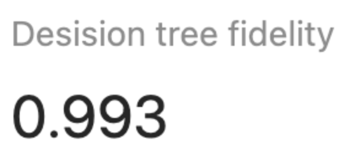
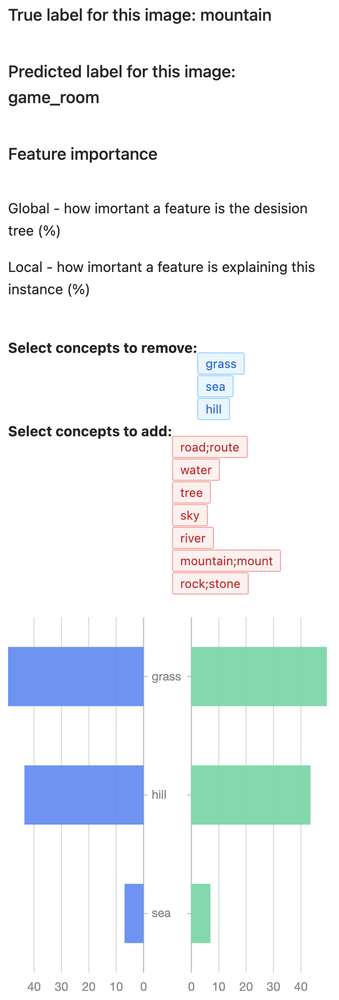
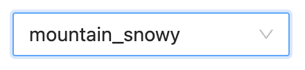
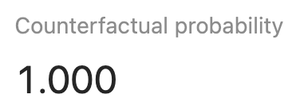

# Explining black box models using concepts

This repository contains the necessary code to explain classification decisions using human-defined concepts either with decision trees or counterfactuals.

## Running the code locally

The code has two parts: the front end and the back end. Both of them are needed to run the demos

### Frontend

```bash
npm run install
npm run build
npm run start
```

If you want to run it in development mode run this command

```bash
npm run install
npm run dev
```

## Backend

Before starting the server, please download [data](https://drive.google.com/file/d/1BLU0CALcHmnXzcoHmNB5ETasJwN_XIpZ/view?usp=sharing)
and copy its content to the <b>data</b> folder in the server directory. This folder will hold the images and segments used for this demo.

After that run the following command (requires [Docker](https://docs.docker.com/get-docker/))

```bash
docker-compose up --build
```

## Demo

In this demo, you'll learn how to explain a (black box) image classification model using concepts.

### Upload an image

Select the image you would like to classify and later explain


### View the uploaded image

We'll show you the image in our dataset that is closest to the image you uploaded.


### Select concepts

The UI now asks you to choose initial concepts that will be used for generating the first explanation iteration. <br>

#### Decision tree explanation

Decision tree explanations can only use a subset of concepts initially specified by the user. If the user wishes to use concepts they didn't initially select they need to restart the explanation process.


For example, if we choose those concepts:<br>
<br>
mountain;mount
sky
tree
river
grass
rock;stone
water
sea
road;route
hill
<br>

then we get the following explanation


This image is predicted to be a mountain, because of the presence of concepts <b>hill</b> (51.82%), <b>grass</b> (29.61%), and <b>sky</b> (18.57%)<br/>

We're also reporting the performance metrics to the user



Initially, the decision tree is expected to have a very high fidelity, because in this demo the blackbox model is a decision tree that's using all initial concepts.

<br/>

Let's say we're interested in reducing the number of concepts. For the sake of demonstration, lets keep only the 3 top concepts <b>hill</b>,<b>grass</b>, and <b>sea</b>



Removing these concepts changed the prediction from <b>mountain</b> to <b>game_room</b>. The relative importance of concepts also changed:<br/>

(old vs new)
hill: 51.82 % vs 0
grass:29.61% vs 26.16%
sky:18.57% vs 73.84%

<br/>

UI suggests to users more concepts they could add in the order of relevancy.(<b>road;route</b>)

#### Counterfactual explanation

For counterfactual explanations, you need to select the counterfactual class from the dropdown




The image above chose two counterfactual examples. <br>
The tool also shows the probability of that counterfactual example


