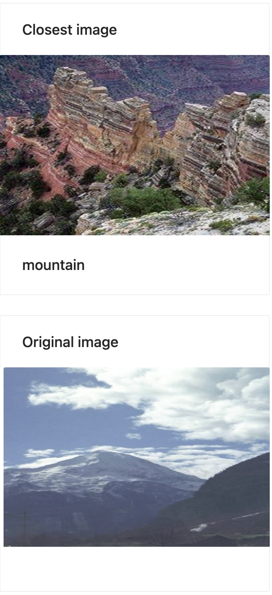
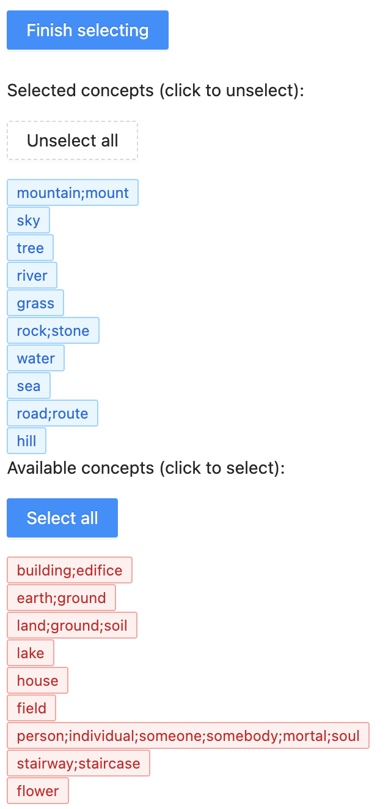
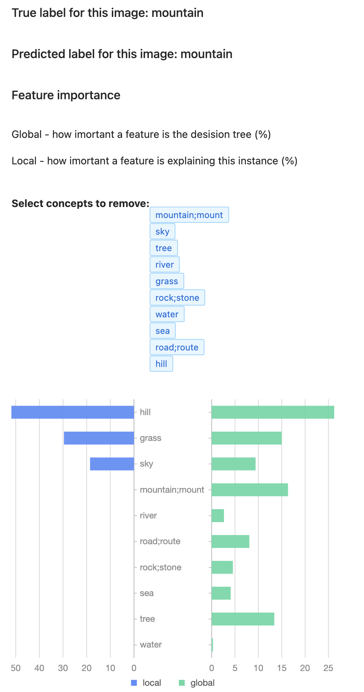
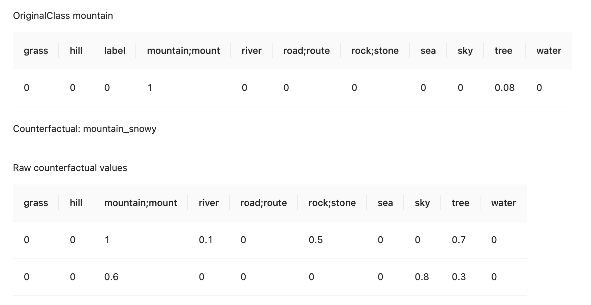

# Explining black box models using concepts

This repository contains the necessary code to explain classification decisions using human-defined concepts either with decision trees or counterfactuals.

## Running the code locally

The code has two parts: the front end and the back end. Both of them are needed to run the demos

### Frontend

```bash
npm run install
npm run build
npm run start
```

If you want to run it in development mode run this command

```bash
npm run install
npm run dev
```

## Backend

Before starting the server, please download [data](https://drive.google.com/file/d/1BLU0CALcHmnXzcoHmNB5ETasJwN_XIpZ/view?usp=sharing)
and copy its content to the <b>data</b> folder in the server directory. This folder will hold the images and segments used for this demo.

After that run the following command (requires [Docker](https://docs.docker.com/get-docker/))

```bash
docker-compose up --build
```

## Demo

In this demo, you'll learn how to explain a (black box) image classification model using concepts.

### Upload an image

Select the image you would like to classify and later explain


### View the uploaded image

We'll show you the image in our dataset that is closest to the image you uploaded.



### Select concepts

This codebase is currently able to provide decision tree-based and counterfactual-based explanations. <br>
By default decision, tree-based explanations are shown at first.

To provide more user-centric explanations we're going to ask you to specify some concepts.<br>

#### Decision tree explanation

We're using all of the concepts specified by you to train a decision tree that explains the black box model responsible for classifying the image shown in the previous step.



For example, if we choose those concepts (tree, sea, sky, rock; stone, sand) then we get the following explanation



This image contains a few, but some are more important than others. For this specific instance the presence of <b>sea</b> (52.28%) and <b>sand</b> (39.02%) are mostly responsible for <b>beach</b> classification. Concept <b>rock; stone</b> (8.7%) also contributed to it, but <b>sand</b> and <b>tree</b> didn't contribute at all to this classification.
<br/>
Overall, sand and tree contributed to the classification, but the feature importance order stayed the same.

#### Counterfactual explanation

For counterfactual explanations, you need to select the counterfactual class from the dropdown


And also the concepts from the counterfactual class <b>mountain</b>


The program generates 2 synthetic counterfactual explanations.



First, this image would be classified as <b>mountain</b> if 60% of the image would be a sky, 40% mountain, and 20% rock<br>
Secondly, this image could be classified as a <b>mountain</b> if 70% of the image would be a mountain, 60% tree, and 50% sand.

The concepts are not mutually exclusive, therefore the sum can be greater than 100%. For example, 60% of the image can be a sea, and 50% of the image can be a sky because there's an overlap between them. The concept representation sum can also be smaller than 100% because there typically are concepts that the user did not select as part of their explanation.

These counterfactual explanations indicate that the presence of the sky paid an important role in classifying the previous image as a <b>beach</b>. The counterfactual explanations also indicate that the presence of a mountain would improve the chances of this image being classified as a <b>mountain</b>.
